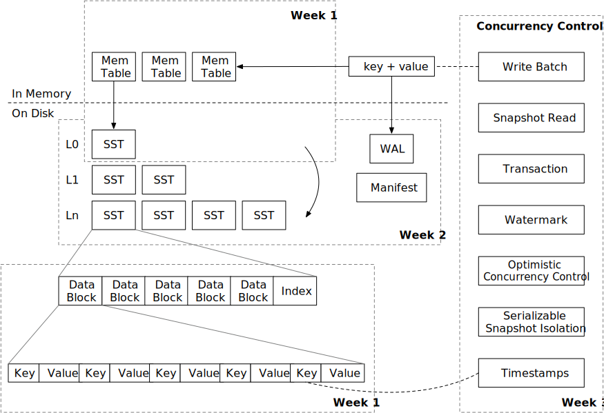
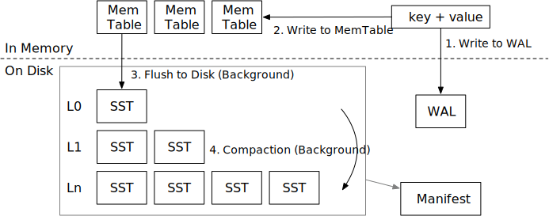

# Mini-LSM 课程概览

## 教程结构

本教程分为三个部分（周）。第一周，我们将重点介绍 LSM 存储引擎的存储结构和存储格式。第二周，我们将深入探讨压缩机制，并为存储引擎实现持久化支持。第三周，我们将实现多版本并发控制。

* [第一周：Mini-LSM](./week1-overview.md)
* [第二周：压缩与持久化](./week2-overview.md)
* [第三周：多版本并发控制](./week3-overview.md)

请查看 [环境搭建](./00-get-started.md) 以设置环境。

## LSM 概述

LSM 存储引擎通常包含三个部分：

1. 预写日志（Write-ahead log），用于持久化临时数据以进行恢复。
2. 磁盘上的 SST（Sorted String Tables），用于维护 LSM 树结构。
3. 内存中的 Mem-table，用于批量处理小写操作。

存储引擎通常提供以下接口：

* `Put(key, value)`：在 LSM 树中存储键值对。
* `Delete(key)`：删除键及其对应的值。
* `Get(key)`：获取与键对应的值。
* `Scan(range)`：获取一系列键值对。

为了确保持久性，

* `Sync()`：确保 `sync` 之前的所有操作都持久化到磁盘。

一些引擎选择将 `Put` 和 `Delete` 合并为一个名为 `WriteBatch` 的操作，该操作接受一批键值对。

在本教程中，我们假设 LSM 树使用的是层级压缩算法，这是实际系统中常用的算法。

### 写路径

LSM 的写路径包含四个步骤：

1. 将键值对写入预写日志，以便在存储引擎崩溃后可以恢复。
2. 将键值对写入 memtable。完成 (1) 和 (2) 后，我们可以通知用户写操作已完成。
3. （在后台运行）当 mem-table 满时，我们将它们冻结为不可变的 mem-table，并在后台将其刷新为磁盘上的 SST 文件。
4. （在后台运行）引擎将某些级别的文件压缩到较低级别，以保持 LSM 树的良好形状，从而降低读放大。

### 读路径

当我们想要读取一个键时，

1. 我们将首先从最新的到最旧的 mem-table 进行探测。
2. 如果未找到键，我们将搜索包含 SST 的整个 LSM 树以查找数据。

有两种类型的读取：查找和扫描。查找在 LSM 树中查找一个键，而扫描遍历存储引擎中某个范围内的所有键。我们将在整个教程中涵盖这两者。

{{#include copyright.md}}
