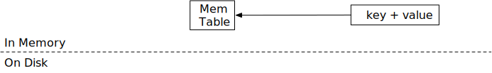

# Memtables


在本章中，您将：

* 基于跳表实现 memtables。
* 实现冻结 memtable 的逻辑。
* 为 memtables 实现 LSM 读取路径 `get`。

要将测试用例复制到启动代码并运行它们，

```
cargo x copy-test --week 1 --day 1
cargo x scheck
```

## 任务 1：跳表 Memtable

在这个任务中，您需要修改：

```
src/mem_table.rs
```

首先，让我们实现 LSM 存储引擎的内存结构——memtable。我们选用 [crossbeam 的跳表实现](https://docs.rs/crossbeam-skiplist/latest/crossbeam_skiplist/) 作为 memtable 的数据结构，这是因为它支持无锁的并发读写操作。我们不会深入讲解跳表的工作原理，简而言之，它是一个有序的键值映射，可以轻松支持并发读写。

crossbeam-skiplist 提供了与 Rust 标准库的 `BTreeMap` 类似的接口：insert、get 和 iter。唯一的区别是修改接口（即 `insert`）只需要跳表的不可变引用，而不是可变引用。因此，在您的实现中，不应在实现 memtable 结构时使用任何互斥锁。

您还会注意到 `MemTable` 结构没有 `delete` 接口。在 mini-lsm 实现中，删除表示为对应于空值的键，我们称之为 *删除 tombstone*。

在这个任务中，您需要实现 `MemTable::get` 和 `MemTable::put` 以启用 memtable 的修改。

我们使用 `bytes` crate 来存储 memtable 中的数据。`bytes::Byte` 类似于 `Arc<[u8]>`。当您克隆 `Bytes` 或获取 `Bytes` 的切片时，底层数据不会被复制，因此克隆它的成本很低。相反，它只是创建了对存储区域的新引用，当没有对该区域的引用时，存储区域将被释放。

## 任务 2：引擎中的单个 Memtable

在这个任务中，您需要修改：

```
src/lsm_storage.rs
```

现在，我们将添加我们的第一个数据结构，memtable，到 LSM 状态中。在 `LsmStorageState::create` 中，您会发现当创建 LSM 结构时，我们将初始化一个 id 为 0 的 memtable。这是初始状态中的 **可变 memtable**。在任何时候，引擎只有一个单一的可变 memtable。memtable 通常有一个大小限制（例如 256MB），当达到大小限制时，它将被冻结为不可变 memtable。

查看 `lsm_storage.rs`，您会发现有两个结构表示存储引擎：`MiniLSM` 和 `LsmStorageInner`。`MiniLSM` 是 `LsmStorageInner` 的薄包装。您将在 `LsmStorageInner` 中实现大部分功能，直到第 2 周的压缩。

`LsmStorageState` 存储当前 LSM 存储引擎的结构。目前，我们只使用 `memtable` 字段，它存储当前的可变 memtable。在这个任务中，您需要实现 `LsmStorageInner::get`、`LsmStorageInner::put` 和 `LsmStorageInner::delete`。它们都应该直接将请求分派到当前的 memtable。



您的 `delete` 实现应该简单地为该键放置一个空切片，我们称之为 *删除 tombstone*。您的 `get` 实现应该相应地处理这种情况。

要访问 memtable，您需要获取 `state` 锁。由于我们的 memtable 实现只需要 `put` 的不可变引用，因此您只需要在修改 memtable 时获取 `state` 的读锁。这允许多个线程并发访问 memtable。

## 任务 3：写路径 - 冻结 Memtable

在这个任务中，您需要修改：

```
src/lsm_storage.rs
src/mem_table.rs
```


Memtable 不能无限增长，当达到大小限制时，我们需要冻结它们（稍后刷新到磁盘）。您可能会在 `LsmStorageOptions` 中找到 memtable 的大小限制，它 **等于 SST 的大小限制**（不是 `num_memtables_limit`）。这不是一个硬限制，您应该尽力冻结 memtable。

在这个任务中，您需要在 memtable 中 put/delete 键时计算近似的 memtable 大小。这可以通过简单地添加 `put` 调用时键和值的总字节数来计算。如果一个键被放置了两次，尽管跳表只包含最新的值，您可以在近似 memtable 大小中计算两次。一旦 memtable 达到限制，您应该调用 `force_freeze_memtable` 来冻结 memtable 并创建一个新的。

因为可能有多个线程将数据写入存储引擎，`force_freeze_memtable` 可能从多个线程并发调用。您