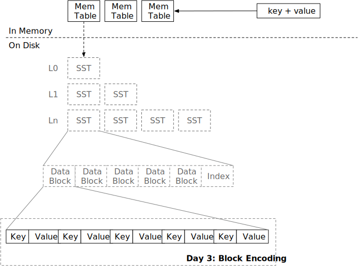

# 块



在本章中，您将：

* 实现 SST 块编码。
* 实现 SST 块解码和块迭代器。

要将测试用例复制到启动代码并运行它们，请执行以下操作：

```
cargo x copy-test --week 1 --day 3
cargo x scheck
```

## 任务 1：块构建器

您已经在前面两章中实现了 LSM 存储引擎的所有内存结构。现在是时候构建磁盘结构了。磁盘结构的基本单元是块。块通常为 4 KB 大小（大小可能因存储介质而异），相当于操作系统中的页面大小和 SSD 上的页面大小。一个块存储有序的键值对。一个 SST 由多个块组成。当 memtable 的数量超过系统限制时，它会将 memtable 刷新为 SST。在本章中，您将实现块的编码和解码。

在本任务中，您需要修改：

```
src/block/builder.rs
src/block.rs
```

我们教程中的块编码格式如下：

```plaintext
----------------------------------------------------------------------------------------------------
|             数据区             |              偏移区              |      额外       |
----------------------------------------------------------------------------------------------------
| 条目 #1 | 条目 #2 | ... | 条目 #N | 偏移 #1 | 偏移 #2 | ... | 偏移 #N | 元素数量 |
----------------------------------------------------------------------------------------------------
```

每个条目是一个键值对。

```plaintext
-----------------------------------------------------------------------
|                           条目 #1                            | ... |
-----------------------------------------------------------------------
| 键长度 (2B) | 键 (键长度) | 值长度 (2B) | 值 (变长) | ... |
-----------------------------------------------------------------------
```

键长度和值长度均为 2 字节，这意味着它们的最大长度为 65535。（内部存储为 `u16`）

我们假设键始终不为空，而值则可能为空。空值意味着在系统的其他部分看来，相应的键已被删除。对于 `BlockBuilder` 和 `BlockIterator`，我们只需将空值视为空值。

在每个块的末尾，我们将存储每个条目的偏移量和总条目数。例如，如果第一个条目位于块的第 0 个位置，第二个条目位于块的第 12 个位置。

```
-------------------------------
|偏移|偏移|元素数量|
-------------------------------
|  0  | 12  |   2   |
-------------------------------
```

块的尾部如上所示。每个数字存储为 `u16`。

块有一个大小限制，即 `target_size`。除非第一个键值对超过目标块大小，否则应确保编码的块大小始终小于或等于 `target_size`。（在提供的代码中，这里的 `target_size` 本质上是 `block_size`）

当调用 `build` 时，`BlockBuilder` 将生成数据部分和未编码的条目偏移量。这些信息将存储在 `Block` 结构中。由于键值条目以原始格式存储，偏移量存储在单独的向量中，这减少了在解码数据时不必要的内存分配和处理开销——您需要做的就是将原始块数据复制到 `data` 向量中，并每 2 字节解码条目偏移量，而不是创建类似 `Vec<(Vec, Vec)>` 的东西来在内存中存储一个块中的所有键值对。这种紧凑的内存布局非常高效。

在 `Block::encode` 和 `Block::decode` 中，您需要按照上述格式编码/解码块。

## 任务 2：块迭代器

在本任务中，您需要修改：

```
src/block/iterator.rs
```

现在我们有了一个编码的块，我们需要实现 `BlockIterator` 接口，以便用户可以在块中查找/扫描键。

`BlockIterator` 可以通过 `Arc` 创建。如果调用 `create_and_seek_to_first`，它将定位在块中的第一个键。如果调用 `create_and_seek_to_key`，迭代器将定位在第一个 `>=` 提供的键的键。例如，如果块中有 `1, 3, 5`。

```rust,no_run
let mut iter = BlockIterator::create_and_seek_to_key(block, b"2");
assert_eq!(iter.key(), b"3");
```

上述 `seek 2` 将使迭代器定位在下一个可用的键 `2`，即 `3`。

迭代器应从块中复制 `key` 并存储在迭代器内部（我们将来会有键压缩，您必须这样做）。对于值，您应该仅在迭代器中存储开始/结束偏移量，而不复制它们。

当调用 `next` 时，迭代器将移动到下一个位置。如果我们到达块的末尾，我们可以将 `key` 设置为空，并从 `is_valid` 返回 `false`，以便调用者可以切换到另一个块（如果可能）。

## 测试您的理解

* 在块中查找键的时间复杂度是多少？
* 在您的实现中，当查找不存在的键时，光标会停在什么位置？
* 因此，`Block` 只是一个原始数据向量和一个偏移向量。我们可以将它们改为 `Byte` 和 `Arc<[u16]>`，并将所有迭代器接口改为返回 `Byte` 而不是 `&[u8]` 吗？（假设我们使用 `Byte::slice` 返回块的切片而不复制。）优点/缺点是什么？
* 在您的实现中，写入块的数字的字节序是什么？
* 您的实现是否容易受到恶意构建的块的影响？如果用户故意构建一个无效的块，是否会有无效的内存访问或 OOM？
* 一个块可以包含重复的键吗？
* 如果用户添加一个大于目标块大小的键会发生什么？
* 考虑 LSM 引擎构建在对象存储服务（S3）上的情况。您将如何优化/改变块格式和参数以使其适合此类服务？
* 你喜欢奶茶吗？为什么或为什么不？

我们不提供这些问题的参考答案，欢迎在 Discord 社区中讨论。

## 额外任务

* **反向迭代器。** 您可以为 `BlockIterator` 实现 `prev`，以便能够反向迭代键值对。您还可以有一个反向合并迭代器和反向 SST 迭代器（在下一章），以便您的存储引擎可以进行反向扫描。

{{#include copyright.md}}
