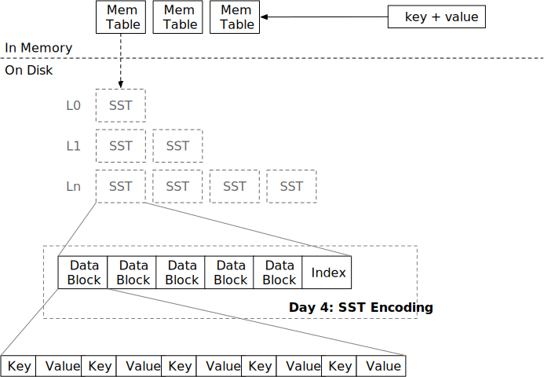

# 排序字符串表 (SST)



在本章中，您将：

* 实现 SST 编码和元数据编码。
* 实现 SST 解码和迭代器。

要复制测试用例到起始代码并运行它们，

```
cargo x copy-test --week 1 --day 4
cargo x scheck
```

## 任务 1：SST 构建器

在这个任务中，您需要修改：

```
src/table/builder.rs
src/table.rs
```

SST 由存储在磁盘上的数据块和索引块组成。通常，数据块是惰性加载的——它们在用户请求之前不会被加载到内存中。索引块也可以按需加载，但在本教程中，我们假设所有 SST 索引块（元块）都可以适应内存（实际上我们没有专门的索引块实现）。一般来说，一个 SST 文件的大小为 256MB。

SST 构建器类似于块构建器——用户将在构建器上调用 `add`。您应该在 SST 构建器内部维护一个 `BlockBuilder` 并在必要时拆分块。此外，您需要维护块元数据 `BlockMeta`，其中包括每个块的首尾键和偏移量。`build` 函数将编码 SST，使用 `FileObject::create` 将所有内容写入磁盘，并返回一个 `SsTable` 对象。

SST 的编码如下：

```plaintext
-------------------------------------------------------------------------------------------
|         数据块部分         |          元数据部分         |          额外部分          |
-------------------------------------------------------------------------------------------
| 数据块 | ... | 数据块 |            元数据           | 元数据块偏移量 (u32) |
-------------------------------------------------------------------------------------------
```

您还需要实现 `SsTableBuilder` 的 `estimated_size` 函数，以便调用者知道何时可以开始写入新的 SST。该函数不需要非常精确。假设数据块包含的数据远多于元数据块，我们可以简单地返回数据块的大小作为 `estimated_size`。

除了 SST 构建器，您还需要完成块元数据的编码/解码，以便 `SsTableBuilder::build` 可以生成有效的 SST 文件。

## 任务 2：SST 迭代器

在这个任务中，您需要修改：

```
src/table/iterator.rs
src/table.rs
```

与 `BlockIterator` 类似，您需要实现一个遍历 SST 的迭代器。请注意，您应该按需加载数据。例如，如果您的迭代器位于块 1，它不应在到达下一个块之前在内存中保留任何其他块内容。

`SsTableIterator` 应实现 `StorageIterator` 特性，以便将来可以与其他迭代器组合。

需要注意的一点是 `seek_to_key` 函数。基本上，您需要在块元数据上进行二分查找，以确定哪个块可能包含该键。可能该键在 LSM 树中不存在，因此块迭代器在查找后会立即失效。例如，

```plaintext
--------------------------------------
| 块 1 | 块 2 |   块元数据   |
--------------------------------------
| a, b, c | e, f, g | 1: a/c, 2: e/g |
--------------------------------------
```

我们建议仅使用每个块的第一个键进行二分查找，以简化您的实现。如果在该 SST 中进行 `seek(b)`，这很简单——通过二分查找，我们可以知道块 1 包含键 `a <= keys < e`。因此，我们加载块 1 并将块迭代器定位到相应位置。

但如果我们进行 `seek(d)`，我们将定位到块 1，如果仅使用第一个键作为二分查找标准，但在块 1 中查找 `d` 将到达块的末尾。因此，我们应该在查找后检查迭代器是否无效，并在必要时切换到下一个块。或者您可以利用最后一个键元数据直接定位到正确的块，这取决于您。

## 任务 3：块缓存

在这个任务中，您需要修改：

```
src/table/iterator.rs
src/table.rs
```

您可以在 `SsTable` 上实现一个新的 `read_block_cached` 函数。

我们使用 `moka-rs` 作为我们的块缓存实现。块通过 `(sst_id, block_id)` 作为缓存键进行缓存。您可以使用 `try_get_with` 从缓存中获取块（如果命中缓存）/填充缓存（如果未命中缓存）。如果有多个请求读取相同的块且缓存未命中，`try_get_with` 只会向磁盘发出一个读取请求，并将结果广播给所有请求。

此时，您可以更改表迭代器以使用 `read_block_cached` 而不是 `read_block` 来利用块缓存。

## 测试您的理解

* 在 SST 中查找键的时间复杂度是多少？
* 在您的实现中，当查找不存在的键时，游标会停在什么位置？
* 是否可能（或必要）对 SST 文件进行就地更新？
* 一个 SST 通常很大（即 256MB）。在这种情况下，复制/扩展 `Vec` 的成本会很高。您的实现是否提前为 SST 构建器分配了足够的空间？您是如何实现的？
* 查看 `moka` 块缓存，为什么它返回 `Arc` 而不是原始的 `Error`？
* 使用块缓存是否保证内存中最多会有固定数量的块？例如，如果您有一个 4GB 的 `moka` 块缓存和 4KB 的块大小，内存中会有超过 4GB/4KB 数量的块吗？
* 是否可以在 LSM 引擎中存储列式数据（即 100 列整数表）？当前的 SST 格式是否仍然是一个好的选择？
* 考虑 LSM 引擎构建在对象存储服务（如 S3）上的情况。您将如何优化/更改 SST 格式/参数和块缓存以使其适合此类服务？
* 目前，我们将所有 SST 的索引加载到内存中。假设您为索引保留了 16GB 内存，您能估计您的 LSM 系统可以支持的数据库的最大大小吗？（这就是为什么您需要索引缓存！）

我们不提供这些问题的参考答案，欢迎在 Discord 社区中讨论。

## 额外任务

* **探索不同的 SST 编码和布局。** 例如，在 [Lethe: Enabling Efficient Deletes in LSMs](https://disc-projects.bu.edu/lethe/) 论文中，作者为 SST 添加了二级键支持。
  * 或者您可以使用 B+ 树作为 SST 格式，而不是排序块。
* **索引块。** 将块索引和块元数据拆分为索引块，并按需加载它们。
* **索引缓存。** 使用一个单独的缓存来存储索引，而不是数据块缓存。
* **I/O 优化。** 将块对齐到 4KB 边界，并使用直接 I/O 绕过系统页缓存。

{{#include copyright.md}}
