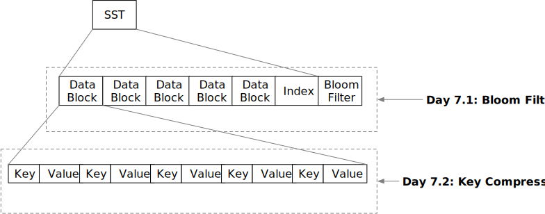

# 小零食时间：SST 优化



在前一章中，您已经构建了一个支持 get/scan/put 的存储引擎。在本周末，我们将实现一些简单但重要的 SST 格式优化。欢迎来到 Mini-LSM 的第一周小零食时间！

在本章中，您将：

* 在 SST 上实现布隆过滤器，并将其集成到 LSM 读取路径 `get` 中。
* 在 SST 块格式中实现键压缩。


要将测试用例复制到初始代码并运行它们，

```
cargo x copy-test --week 1 --day 7
cargo x scheck
```

## 任务 1：布隆过滤器

布隆过滤器是一种概率数据结构，维护一组键。您可以向布隆过滤器添加键，并且可以知道某个键可能存在/必须不存在于添加到布隆过滤器的键集合中。

通常需要有一个哈希函数来构造布隆过滤器，一个键可以有多个哈希值。让我们来看下面的例子。假设我们已经有了一些键的哈希值，并且布隆过滤器有 7 位。

[注：如果您想更好地理解布隆过滤器，请查看 [这里](https://samwho.dev/bloom-filters/)]

```plaintext 
hash1 = ((character - a) * 13) % 7
hash2 = ((character - a) * 11) % 7
b -> 6 4
c -> 5 1
d -> 4 5
e -> 3 2
g -> 1 3
h -> 0 0
```

如果我们插入 b, c, d 到 7 位布隆过滤器中，我们将得到：

```
    位  0123456
插入 b     1 1
插入 c  1   1
插入 d     11
结果   0101111
```

当探测布隆过滤器时，我们为键生成哈希值，并查看相应的位是否已设置。如果所有位都设置为 true，则该键可能存在于布隆过滤器中。否则，该键必须不存在于布隆过滤器中。

对于 `e -> 3 2`，由于位 2 未设置，它不应在原始集合中。对于 `g -> 1 3`，因为两位都已设置，它可能存在也可能不存在于集合中。对于 `h -> 0 0`，两位（实际上是一位）都未设置，因此它不应在原始集合中。

```
b -> 可能（实际：是）
c -> 可能（实际：是）
d -> 可能（实际：是）
e -> 必须不（实际：否）
g -> 可能（实际：否）
h -> 必须不（实际：否）
```

记住在上一个章节的末尾，我们基于键范围实现了 SST 过滤。现在，在 `get` 读取路径上，我们还可以使用布隆过滤器来忽略不包含用户想要查找的键的 SST，从而减少从磁盘读取的文件数量。

在本任务中，您需要修改：

```
src/table/bloom.rs
```

在实现中，您将从键哈希（u32 数字）构建布隆过滤器。对于每个哈希，您需要设置 `k` 位。这些位是通过以下方式计算的：

```rust,no_run
let delta = (h >> 17) | (h << 15); // h 是键哈希
for _ in 0..k {
    // TODO: 使用哈希设置相应的位
    h = h.wrapping_add(delta);
}
```

我们提供了所有进行数学运算的骨架代码。您只需要实现构建布隆过滤器和探测布隆过滤器的过程。

## 任务 2：在读取路径上集成布隆过滤器

在本任务中，您需要修改：

```
src/table/builder.rs
src/table.rs
src/lsm_storage.rs
```

对于布隆过滤器编码，您可以将布隆过滤器附加到 SST 文件的末尾。您需要在文件末尾存储布隆过滤器偏移量，并相应地计算元数据偏移量。

```plaintext
-----------------------------------------------------------------------------------------------------
|         块部分         |                            元数据部分                           |
-----------------------------------------------------------------------------------------------------
| 数据块 | ... | 数据块 | 元数据 | 元数据块偏移 | 布隆过滤器 | 布隆过滤器偏移 |
|                               | 变长  |         u32       |    变长    |        u32          |
-----------------------------------------------------------------------------------------------------
```

我们使用 `farmhash` crate 来计算键的哈希值。在构建 SST 时，您还需要通过使用 `farmhash::fingerprint32` 计算键哈希来构建布隆过滤器。您需要将布隆过滤器与块元数据进行编码/解码。您可以选择布隆过滤器的假阳性率为 0.01。除了初始代码中提供的字段外，您可能还需要添加新的字段。

之后，您可以修改 `get` 读取路径以基于布隆过滤器过滤 SST。

我们没有为此部分提供集成测试，您需要确保您的实现仍然通过所有之前的章节测试。

## 任务 3：键前缀编码 + 解码

在本任务中，您需要修改：

```
src/block/builder.rs
src/block/iterator.rs
```

由于 SST 文件按顺序存储键，用户存储的键可能具有相同的前缀，因此我们可以在 SST 编码中压缩前缀以节省空间。

我们将当前键与块中的第一个键进行比较。我们按以下方式存储键：

```
键重叠长度（u16） | 剩余键长度（u16） | 键（剩余键长度）
```

`键重叠长度` 表示与块中第一个键相同的字节数。例如，如果我们看到一条记录：`5|3|LSM`，其中块中的第一个键是 `mini-something`，我们可以恢复当前键为 `mini-LSM`。

完成编码后，您还需要在块迭代器中实现解码。除了初始代码中提供的字段外，您可能还需要添加新的字段。

## 测试您的理解

* 布隆过滤器如何帮助 SST 过滤过程？它能告诉您关于键的什么信息？（可能不存在/可能存在/必须存在/必须不存在）
* 考虑我们需要一个反向迭代器的情况。我们的键压缩会影响反向迭代器吗？
* 您可以在扫描中使用布隆过滤器吗？
* 相对于与块中的第一个键进行键前缀编码，与相邻键进行键前缀编码可能有什么优缺点？

我们没有为这些问题提供参考答案，欢迎在 Discord 社区中讨论。

{{#include copyright.md}}
