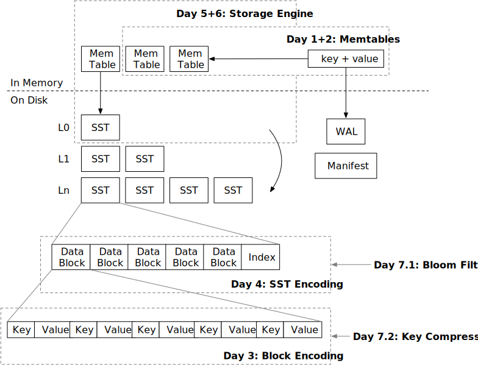

# 第一周概览：Mini-LSM

在教程的第一周，您将构建存储引擎所需的存储格式，包括系统的读路径和写路径，并实现一个基于LSM的键值存储的工作实现。这部分共有7个章节（天）。

* [第一天：Memtable](./week1-01-memtable.md)。您将实现内存中的读写路径。
* [第二天：合并迭代器](./week1-02-merge-iterator.md)。您将扩展第一天构建的内容，并为您的系统实现一个`scan`接口。
* [第三天：块编码](./week1-03-block.md)。现在我们开始磁盘结构的第一个步骤，并构建块的编码/解码。
* [第四天：SST编码](./week1-04-sst.md)。SST由块组成，在这一天结束时，您将拥有LSM磁盘结构的基本构建块。
* [第五天：读路径](./week1-05-read-path.md)。现在我们既有内存结构也有磁盘结构，我们可以将它们结合起来，并为存储引擎实现一个完全工作的读路径。
* [第六天：写路径](./week1-06-write-path.md)。在第五天，测试工具生成这些结构，而在第六天，您将自行控制SST的刷新。您将实现刷新到level-0 SST，并完成存储引擎的构建。
* [第七天：SST优化](./week1-07-sst-optimizations.md)。我们将实现几个SST格式的优化，并提高系统的性能。

在本周结束时，您的存储引擎应该能够处理所有的get/scan/put请求。唯一缺少的部分是将LSM状态持久化到磁盘，以及在磁盘上更有效地组织SST的方法。您将拥有一个工作的**Mini-LSM**存储引擎。

{{#include copyright.md}}
