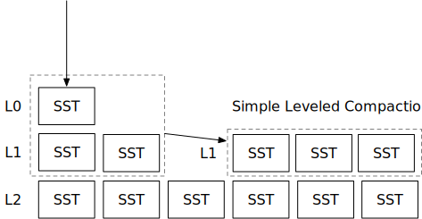

# 简单压缩策略



在本章中，您将：

* 实现一个简单的分层压缩策略，并在压缩模拟器上模拟它。
* 将压缩作为后台任务启动，并在系统中实现压缩触发器。

要复制测试用例到起始代码并运行它们，请执行以下命令：

```
cargo x copy-test --week 2 --day 2
cargo x scheck
```


在阅读本章之前，查看[第2周概览](./week2-overview.md)可能会有所帮助，以便对压缩有一个总体了解。


## 任务1：简单分层压缩

在本章中，我们将实现我们的第一个压缩策略——简单分层压缩。在本任务中，您需要修改：

```
src/compact/simple_leveled.rs
```

简单分层压缩策略与原始LSM论文中的策略相似。它维护LSM树的多个层级。当一个层级（>= L1）过大时，它会将该层级的所有SST文件与下一层级合并。压缩策略由`SimpleLeveledCompactionOptions`中定义的3个参数控制。

* `size_ratio_percent`：下层文件数量与上层文件数量的比率。实际上，我们应该计算文件的实际大小。然而，我们简化了公式，使用文件数量来使其更容易进行模拟。当比率过低（上层有太多文件）时，我们应该触发压缩。
* `level0_file_num_compaction_trigger`：当L0中的SST文件数量大于或等于此数量时，触发L0和L1的压缩。
* `max_levels`：LSM树中的层级数量（不包括L0）。

假设size_ratio_percent=200（下层应有上层文件数量的2倍），max_levels=3，level0_file_num_compaction_trigger=2，我们来看下面的例子。

假设引擎刷新了两个L0 SST文件。这达到了`level0_file_num_compaction_trigger`，您的控制器应触发L0->L1压缩。

```
--- 刷新后 ---
L0 (2): [1, 2]
L1 (0): []
L2 (0): []
L3 (0): []
--- 压缩后 ---
L0 (0): []
L1 (2): [3, 4]
L2 (0): []
L3 (0): []
```

现在，L2为空而L1有两个文件。L1和L2的大小比率为`(L2/L1) * 100 = (0/2) * 100 = 0 < size_ratio_percent (200)`。因此，我们将触发L1+L2压缩，将数据推到L2。同样适用于L2，这两个SST文件将在两次压缩后放置在最底层。

```
--- 压缩后 ---
L0 (0): []
L1 (0): []
L2 (2): [5, 6]
L3 (0): []
--- 压缩后 ---
L0 (0): []
L1 (0): []
L2 (0): []
L3 (2): [7, 8]
```

继续刷新SST文件，我们会发现：

```
L0 (0): []
L1 (0): []
L2 (2): [13, 14]
L3 (2): [7, 8]
```

此时，`L3/L2= (1 / 1) * 100 = 100 < size_ratio_percent (200)`。因此，我们需要触发L2和L3之间的压缩。

```
--- 压缩后 ---
L0 (0): []
L1 (0): []
L2 (0): []
L3 (4): [15, 16, 17, 18]
```

当我们刷新更多SST文件时，我们可能会达到以下状态：

```
--- 刷新后 ---
L0 (2): [19, 20]
L1 (0): []
L2 (0): []
L3 (4): [15, 16, 17, 18]
--- 压缩后 ---
L0 (0): []
L1 (0): []
L2 (2): [23, 24]
L3 (4): [15, 16, 17, 18]
```

因为`L3/L2 = (4 / 2) * 100 = 200 >= size_ratio_percent (200)`，我们不需要合并L2和L3，最终会达到上述状态。简单分层压缩策略总是压缩整个层级，并保持层级之间的扇出大小，使得下层总是上层的某个倍数。

我们已经初始化了LSM状态，使其具有`max_level`个层级。您应该首先实现`generate_compaction_task`，根据上述3个标准生成压缩任务。之后，实现`apply_compaction_result`。我们建议您先实现L0触发器，运行压缩模拟，然后实现大小比率触发器，再运行压缩模拟。要运行压缩模拟，请执行以下命令：

```shell
cargo run --bin compaction-simulator-ref simple # 参考解决方案
cargo run --bin compaction-simulator simple # 您的解决方案
```

模拟器将刷新一个L0 SST到LSM状态，运行您的压缩控制器生成压缩任务，然后应用压缩结果。每次刷新新的SST时，它会重复调用控制器，直到不需要安排压缩，因此您应确保您的压缩任务生成器会收敛。

在您的压缩实现中，应尽可能减少活动迭代器的数量（即使用concat迭代器）。同时，记住合并顺序很重要，您需要确保创建的迭代器在多个版本的键出现时按正确顺序生成键值对。

还要注意，实现中的一些参数是基于0的，而一些是基于1的。在使用`level`作为向量索引时要小心。

**注意：我们没有为此部分提供细粒度的单元测试。您可以运行压缩模拟器，并与参考解决方案的输出进行比较，以查看您的实现是否正确。**

## 任务2：压缩线程

在本任务中，您需要修改：

```
src/compact.rs
```

现在您已经实现了压缩策略，您需要在一个后台线程中运行它，以便在后台压缩文件。在`compact.rs`中，`trigger_compaction`每50毫秒被调用一次，您需要：

1. 生成一个压缩任务，如果不需要安排任务，返回ok。
2. 运行压缩并获取新SST文件的列表。
3. 类似于您在前一章中实现的`force_full_compaction`，更新LSM状态。

## 任务3：与读取路径集成

在本任务中，