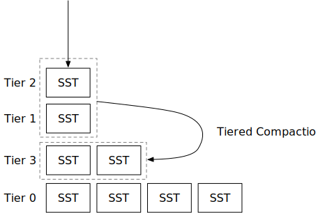

# 分层压缩策略



在本章中，您将：

* 实现一种分层压缩策略，并在压缩模拟器上模拟它。
* 将分层压缩策略整合到系统中。

本章中讨论的分层压缩与RocksDB的通用压缩相同。我们将交替使用这两个术语。

要将测试案例复制到启动代码并运行它们，

```
cargo x copy-test --week 2 --day 3
cargo x scheck
```


在阅读本章之前，查看[第2周概览](./week2-overview.md)可能会有所帮助，以便对压缩有一个大致的了解。


## 任务1：通用压缩

在本章中，您将实现RocksDB的通用压缩，这是一种分层压缩家族的压缩策略。与简单的层级压缩策略类似，我们仅使用文件数量作为此压缩策略的指标。当我们触发压缩任务时，我们总是包括一个完整的排序运行（层级）在压缩任务中。

### 任务1.0：前提条件

在这个任务中，您需要修改：

```
src/compact/tiered.rs
```

在通用压缩中，我们不在LSM状态中使用L0 SST。相反，我们直接将新的SST刷新到一个单一的排序运行（称为层级）。在LSM状态中，`levels`现在将包括所有层级，其中**最低索引是最新刷新的SST**。`levels`向量中的每个元素存储一个元组：层级ID（用作层级ID）和该层级中的SST。每次您刷新L0 SST时，您应该将SST刷新到向量前部的层级中。压缩模拟器根据第一个SST ID生成层级ID，您应该在您的实现中做同样的事情。

通用压缩仅在层级（排序运行）数量大于`num_tiers`时触发任务。否则，它不会触发任何压缩。

### 任务1.1：由空间放大比率触发

通用压缩的第一个触发是由空间放大比率触发的。正如我们在概览章节中讨论的，空间放大可以通过`engine_size / last_level_size`来估计。在我们的实现中，我们通过`除最后一个层级外的所有层级大小 / 最后一个层级大小`来计算空间放大比率，这样比率可以缩放到`[0, +inf)`而不是`[1, +inf]`。这也与RocksDB的实现一致。

当`除最后一个层级外的所有层级大小 / 最后一个层级大小` >= `max_size_amplification_percent * 100%`时，我们需要触发一个完全压缩。

在您实现这个触发后，您可以运行压缩模拟器。您将看到：

```shell
cargo run --bin compaction-simulator tiered
```

```
--- 刷新后 ---
L3 (1): [3]
L2 (1): [2]
L1 (1): [1]
--- 压缩任务 ---
由空间放大比率触发的压缩: 200
L3 [3] L2 [2] L1 [1] -> [4, 5, 6]
--- 压缩后 ---
L4 (3): [3, 2, 1]
```

通过这个触发，我们仅在达到空间放大比率时触发完全压缩。在模拟结束时，您将看到：

```
--- 刷新后 ---
L73 (1): [73]
L72 (1): [72]
L71 (1): [71]
L70 (1): [70]
L69 (1): [69]
L68 (1): [68]
L67 (1): [67]
L40 (27): [39, 38, 37, 36, 35, 34, 33, 32, 31, 30, 29, 28, 27, 26, 25, 24, 23, 22, 13, 14, 15, 16, 17, 18, 19, 20, 21]
```

压缩模拟器中的`num_tiers`设置为3。然而，LSM状态中有远多于3个层级，这导致了大量的读取放大。

当前的触发仅减少了空间放大。我们需要向压缩算法添加新的触发器以减少读取放大。

### 任务1.2：由大小比率触发

下一个触发是大小比率触发。对于所有层级，如果有一个层级`n`使得`所有前一层级的大小 / 这个层级 >= (100 + size_ratio) * 100%`，我们将压缩所有`n`个层级。我们仅在合并的层级数量超过`min_merge_width`时进行此压缩。

通过这个触发，您将在压缩模拟器中观察到以下内容：

```
L207 (1): [207]
L204 (3): [203, 202, 201]
L186 (15): [185, 178, 179, 180, 181, 182, 183, 184, 158, 159, 160, 161, 162, 163, 164]
L114 (31): [113, 98, 99, 100, 101, 102, 103, 104, 105, 106, 107, 108, 109, 1