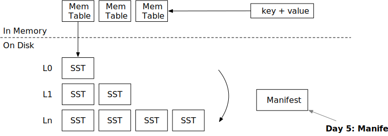

# 清单文件



在本章中，您将：

* 实现清单文件的编码和解码。
* 系统重启时从清单文件中恢复。

要将测试用例复制到启动代码并运行它们，请执行以下操作：

```
cargo x copy-test --week 2 --day 5
cargo x scheck
```

## 任务1：清单文件编码

系统使用清单文件记录引擎中发生的所有操作。目前，只有两种类型：合并和SST刷新。当引擎重启时，它会读取清单文件，重建状态，并加载磁盘上的SST文件。

存储LSM状态的方法有很多。最简单的方法是将完整状态存储到一个JSON文件中。每次进行合并或刷新新的SST时，我们可以将整个LSM状态序列化到一个文件中。这种方法的问题是，当数据库变得非常大（例如，10k个SST）时，将清单写入磁盘会非常慢。因此，我们设计了清单文件为仅追加文件。

在本任务中，您需要修改：

```
src/manifest.rs
```

我们使用JSON对清单记录进行编码。您可以使用`serde_json::to_vec`将清单记录编码为JSON，将其写入清单文件，并执行fsync。读取清单文件时，您可以使用`serde_json::Deserializer::from_slice`，它将返回一个记录流。您不需要存储记录长度等信息，因为`serde_json`可以自动找到记录的分隔。

清单文件格式如下：

```
| JSON记录 | JSON记录 | JSON记录 | JSON记录 |
```

再次注意，我们不记录每个记录的字节数。

引擎运行几小时后，清单文件可能会变得非常大。此时，您可以定期压缩清单文件以存储当前快照并截断日志。这是您可以作为额外任务实现的优化。

## 任务2：写入清单文件

现在，您可以继续修改您的LSM引擎，在必要时写入清单文件。在本任务中，您需要修改：

```
src/lsm_storage.rs
src/compact.rs
```

目前，我们只使用两种类型的清单记录：SST刷新和合并。SST刷新记录存储刷新到磁盘的SST ID。合并记录存储合并任务和生成的SST ID。每次将新文件写入磁盘时，首先同步文件和存储目录，然后写入清单并同步清单。清单文件应写入`<路径>/MANIFEST`。

要同步目录，您可以实现`sync_dir`函数，在该函数中可以使用`File::open(dir).sync_all()?`来同步目录。在Linux上，目录是一个包含目录中文件列表的文件。通过在目录上执行fsync，您将确保新写入（或删除）的文件在断电时对用户可见。

记得为后台合并触发（层级/简单/通用）和用户请求强制合并时写入合并清单记录。

## 任务3：关闭时刷新

在本任务中，您需要修改：

```
src/lsm_storage.rs
```

您需要实现`close`函数。如果`self.options.enable_wal = false`（我们将在下一章节介绍WAL），您应该在停止存储引擎之前将所有内存表刷新到磁盘，以确保所有用户更改都持久化。

## 任务4：从状态恢复

在本任务中，您需要修改：

```
src/lsm_storage.rs
```

现在，您可以修改`open`函数，从清单文件中恢复引擎状态。要恢复它，您需要首先生成需要加载的SST列表。您可以通过调用`apply_compaction_result`并在LSM状态中恢复SST ID来实现这一点。之后，您可以遍历状态并加载所有SST（更新sstables哈希映射）。在此过程中，您需要计算最大SST ID并更新`next_sst_id`字段。之后，您可以使用该ID创建一个新的内存表，并将ID加1。

如果您实现了层级合并，每次应用合并结果时，您可能已经对SST进行了排序。然而，在清单恢复过程中，您的排序逻辑会被破坏，因为在恢复过程中，您无法知道每个SST的起始键和结束键。要解决这个问题，您需要读取`apply_compaction_result`函数的`in_recovery`标志。在恢复过程中，您不应尝试检索SST的第一个键。在LSM状态恢复且所有SST打开后，您可以在恢复过程结束时进行排序。

可选地，您可以在清单中包含每个SST的起始键和结束键。RocksDB/BadgerDB使用了这种策略，因此在应用合并过程中您不需要区分恢复模式和正常模式。

您可以使用mini-lsm-cli测试您的实现。

```
cargo run --bin mini-lsm-cli
fill 1000 2000
close
cargo run --bin mini-lsm-cli
get 1500
```

## 测试您的理解

* 何时需要调用`fsync`？为什么需要同步目录？
* 哪些地方需要写入清单文件？
* 考虑一个不使用清单文件的LSM引擎的替代实现。相反，它在每个文件的头部记录层级/层信息，每次重启时扫描存储目录，仅从目录中的文件恢复LSM状态。这种实现能否正确维护LSM状态，可能存在哪些问题/挑战？
* 目前，我们在创建合并迭代器之前创建所有SST/合并迭代器，这意味着在开始扫描过程之前，我们必须将所有层级中第一个SST的第一个块加载到内存中。我们在清单中有起始/结束键，是否可以利用这些信息延迟数据块的加载，从而加快返回第一个键值对的时间？
* 是否可以不在清单中存储层级/层信息？即，我们只存储清单中我们拥有的SST列表，而不存储层级信息，并使用键范围和时间戳信息（SST元数据）重建层级/层。

## 额外任务

* **清单压缩。** 当清单文件中的日志数量过多时，您可以重写清单文件，只存储当前快照并将新日志追加到该文件中。
* **并行打开。** 在收集到需要打开的SST列表后，您可以并行打开和解码它们，而不是逐个进行，从而加速恢复过程。

{{#include copyright.md}}
