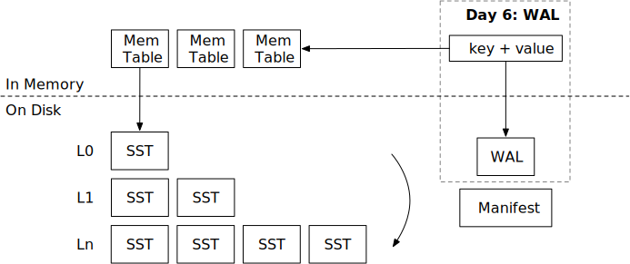

# 预写日志 (WAL)



在本章中，您将：

* 实现预写日志文件的编码和解码。
* 在系统重启时从 WAL 中恢复内存表。

要将测试用例复制到启动代码并运行它们，请执行以下命令：

```
cargo x copy-test --week 2 --day 6
cargo x scheck
```

## 任务 1：WAL 编码

在这个任务中，您需要修改：

```
src/wal.rs
```

在前一章中，我们已经实现了清单文件，使得 LSM 状态可以持久化。并且我们实现了 `close` 函数，在停止引擎之前将所有内存表刷新到 SST 中。现在，如果系统崩溃（即断电）怎么办？我们可以将内存表修改记录到 WAL（预写日志）中，并在重启数据库时恢复 WAL。只有当 `self.options.enable_wal = true` 时，WAL 才会启用。

WAL 编码只是一个键值对列表。

```
| key_len | key | value_len | value |
```

您还需要实现 `recover` 函数，从 WAL 读取并恢复内存表的状态。

请注意，我们使用 `BufWriter` 进行 WAL 写入。使用 `BufWriter` 可以减少进入操作系统的系统调用次数，从而减少写路径的延迟。当用户修改键时，数据不保证写入磁盘。相反，引擎仅保证在调用 `sync` 时数据是持久的。为了正确地将数据持久化到磁盘，您需要首先通过调用 `flush()` 将数据从缓冲写入器刷新到文件对象，然后使用 `get_mut().sync_all()` 对文件进行 fsync。请注意，您*仅*需要在引擎的 `sync` 被调用时进行 fsync。您*不需要*在每次写入数据时进行 fsync。

## 任务 2：集成 WAL

在这个任务中，您需要修改：

```
src/mem_table.rs
src/wal.rs
src/lsm_storage.rs
```

`MemTable` 有一个 WAL 字段。如果 `wal` 字段设置为 `Some(wal)`，您需要在更新内存表时追加到 WAL。在您的 LSM 引擎中，如果 `enable_wal = true`，您需要创建 WAL。您还需要在创建新内存表时使用 `ManifestRecord::NewMemtable` 记录更新清单。

您可以使用 `create_with_wal` 函数创建带有 WAL 的内存表。WAL 应写入存储目录中的 `.wal`。内存表 ID 应与作为 L0 SST 刷新的内存表的 SST ID 相同。

## 任务 3：从 WAL 恢复

在这个任务中，您需要修改：

```
src/lsm_storage.rs
```

如果启用了 WAL，您需要在加载数据库时基于 WAL 恢复内存表。您还需要实现数据库的 `sync` 函数。`sync` 的基本保证是引擎确定数据已持久化到磁盘（并且在重启时可以恢复）。为了实现这一点，您可以简单地同步当前内存表对应的 WAL。

```
cargo run --bin mini-lsm-cli -- --enable-wal
```

请记住从状态中恢复正确的 `next_sst_id`，它应为 `max{memtable id, sst id}` + 1。在您的 `close` 函数中，如果 `enable_wal` 设置为 true，则不应将内存表刷新到 SST，因为 WAL 本身提供持久性。您应该等到所有压缩和刷新线程退出后再关闭数据库。

## 测试您的理解

* 您应该在何时在引擎中调用 `fsync`？如果您在每次 put 键请求时调用 `fsync` 会发生什么？
* 在 SSD（固态驱动器）上，`fsync` 操作通常有多昂贵？
* 您何时可以告诉用户他们的修改（put/delete）已持久化？
* 您如何处理 WAL 中的损坏数据？

我们不提供这些问题的参考答案，欢迎在 Discord 社区中讨论。

{{#include copyright.md}}
