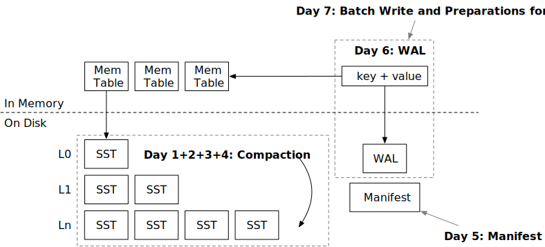
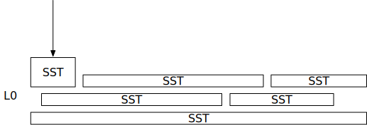
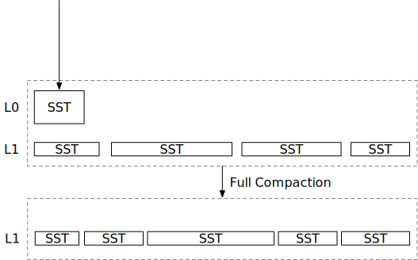

# 第二周概览：压缩与持久化



在上一周，您已经实现了LSM存储引擎所需的所有结构，并且您的存储引擎已经支持读写接口。本周，我们将深入探讨SST文件的磁盘组织，并研究在系统中实现性能和成本效率的最佳方法。我们将用4天时间学习不同的压缩策略，从最简单的到最复杂的，然后实现存储引擎持久化的剩余部分。到本周末，您将拥有一个功能齐全且高效的LSM存储引擎。

本周我们有7个章节（天）：

* [第一天：压缩实现](./week2-01-compaction.md)。您将把所有L0 SST合并为一个有序的运行。
* [第二天：简单层级压缩](./week2-02-simple.md)。您将实现一个经典的层级压缩算法，并使用压缩模拟器查看其效果。
* [第三天：分层/通用压缩](./week2-03-tiered.md)。您将实现RocksDB的通用压缩算法，并理解其优缺点。
* [第四天：层级压缩](./week2-04-leveled.md)。您将实现RocksDB的层级压缩算法。该压缩算法还支持部分压缩，以减少峰值空间使用。
* [第五天：清单](./week2-05-manifest.md)。您将把LSM状态存储在磁盘上，并从中恢复。
* [第六天：预写日志（WAL）](./week2-06-wal.md)。用户请求将被路由到memtable和WAL，以便所有操作都能持久化。
* [第七天：写批处理和校验和](./week2-07-snacks.md)。您将实现写批处理API（为第三周MVCC做准备）和所有存储格式的校验和。

## 压缩与读取放大

让我们先谈谈压缩。在上一部分中，您只是将memtable刷新到L0 SST。想象一下，您已经写入了千兆字节的数据，现在您有100个SST。每个读取请求（不带过滤）都需要从这些SST中读取100个块。这种放大是读取放大——为了一个get操作，您需要向磁盘发送的I/O请求数量。

为了减少读取放大，我们可以将所有L0 SST合并为一个更大的结构，这样就只需读取一个SST和一个块来检索请求的数据。假设我们仍然有这100个SST，现在，我们对这100个SST进行合并排序，生成另外100个SST，每个SST包含非重叠的键范围。这个过程就是**压缩**，这100个非重叠的SST就是一个**有序运行**。

为了更清楚地说明这个过程，让我们看一个具体的例子：

```
SST 1: 键范围 00000 - 键 10000, 1000 键
SST 2: 键范围 00005 - 键 10005, 1000 键
SST 3: 键范围 00010 - 键 10010, 1000 键
```

我们在LSM结构中有3个SST。如果我们需要访问键02333，我们将需要探测所有这3个SST。如果我们进行压缩，我们可能会得到以下3个新的SST：

```
SST 4: 键范围 00000 - 键 03000, 1000 键
SST 5: 键范围 03001 - 键 06000, 1000 键
SST 6: 键范围 06000 - 键 10010, 1000 键
```

这3个新的SST是通过合并SST 1、2和3创建的。我们可以得到一个有序的3000个键，然后将其分成3个文件，以避免有一个超级大的SST文件。现在我们的LSM状态有3个非重叠的SST，我们只需要访问SST 4来查找键02333。

## 压缩的两个极端与写入放大

从上面的例子中，我们有两个处理LSM结构的简单方法——完全不做压缩，以及在新SST刷新时总是进行完全压缩。

压缩是一个耗时的操作。它需要从某些文件中读取所有数据，并将相同数量的文件写入磁盘。这个操作需要大量的CPU资源和I/O资源。完全不做压缩会导致高读取放大，但它不需要写入新文件。总是进行完全压缩减少了读取放大，但它需要不断重写磁盘上的文件。



完全不压缩



新SST刷新时总是进行完全压缩

将memtable刷新到磁盘与写入磁盘的总数据量的比率是写入放大。也就是说，不进行压缩的写入放大比率为1x，因为一旦SST刷新到磁盘，它们就会留在那里。总是进行压缩的写入放大非常高。如果我们每次得到一个SST时都进行完全压缩，写入磁盘的数据量将是对刷新到磁盘的SST数量的平方。例如，如果我们向磁盘刷新了100个SST，我们将进行2个文件、3个文件、...、100个文件的压缩，实际写入磁盘的总数据量约为5000个SST。在这种情况下，写入100个SST后的写入放大将是50